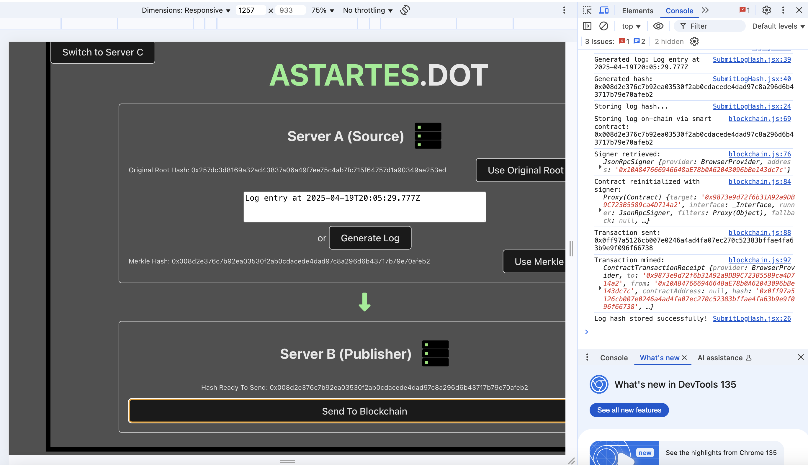

 
    
 

<strong style="font-size: 24px;">"Tamper-Evident Logging for Zero-Trust Infrastructure"</strong>

    
        
    

---

### What is Astartes.Dot?

Astartes is a tamper-evident logging and forensic audit system designed to enhance integrity in high-security infrastructure. It ensures that logs cannot be silently altered by internal actors—even with privileged access—by anchoring cryptographic proofs to a public blockchain and verifying log consistency across distributed systems.

Built with modularity in mind, Astartes uses lightweight agents to compute Merkle roots on each server, a centralized verifier to perform cross-checks and a blockchain publisher to anchor immutable proofs. This layered approach provides robust, post-event forensic traceability without introducing major overhead.

Astartes can operate independently or complement other systems like centralized detection-as-code frameworks. It’s designed for scale and becomes more cost-efficient as infrastructure grows—ideal for government departments and medium to large orgs.

### Features

- **Local Hashing (Server A - Source):** Collects logs and builds Merkle Trees at the endpoint, sending roots for anchoring and verification to ensure tamper-evident integrity.
- **Blockchain Anchoring (Server B - Publisher):** Publishes a super Merkle root to a low-fee chain (Polkadot Asset Hub) to create a tamper-evident audit trail.
- **Centralised Verification (Server C - Verifier):** Aggregates Merkle roots, verifies consistency and challenges Server A and B for tamper detection.
- **Merkle Tree Integrity Checks:** Enables pinpoint detection of altered logs down to individual entries through cryptographic proofs.
- **Anchoring Flexibility:** Supports daily or hourly anchoring, balancing cost with forensic granularity.
- **Modular Architecture:** Can run on AWS (Lambda, EC2, Fargate) or on-premises infrastructure with minimal integration friction.
- **Tamper Challenge System:** Server C can be configured to periodically challenge Server A and B for proactive integrity assurance.
- **Shared Cost Efficiency:** Designed for scale — per-server costs drop significantly in medium to large orgs through shared compute and anchoring infrastructure.

### Technical Architecture

### Demo

- [Demo v1 ](https://youtu.be/LwBXunE7pZc)(20 April 2025)

### Images

Server A (Source) has sent merkle hash to Server B (Publisher), which is now ready to anchor on-chain

Server C (Verifier) compares tampered off-chain data and on-chain data

Merkle Tree represents logs; showing tree depth, levels and nodes

A log that is tampered in the Merkle Tree is highlighted in red

An actual Merkle Tree is generated in the terminal by running `node scripts/MerkleTreeScript.js`

Smart contract is created using remix.polkadot.io

Transaction request pops up when submitting merkle root hash to blockchain

Transaction mined

### Roadmap

- [x] Visualise the behaviour we expect in a UI for our agents running under the hood.
- [x] Build Server A agent to hash macOS logs and construct Merkle Trees
- [x] Transmit Merkle root from Server A to Server B for anchoring
- [x] Anchor Merkle root on-chain via Server B (Polkadot Asset Hub)
- [x] Send Merkle root from Server A to Server C for verification
- [x] Compare Merkle roots from Server A and on-chain data in Server C
- [x] Trigger real-time alert in UI upon detection of tampering
- [x] Visualize Merkle Tree and logs in live UI demo; demonstarting forensic advantage
- [x] Display side-by-side on-chain and off-chain state in frontend
- [ ] Automate interval-based Merkle root generation on Server A
- [ ] Automate Server B anchoring process (e.g., daily, hourly)
- [ ] Automate Server C challenge routine (e.g., 5-min for A, hourly for B)
- [ ] Add basic metrics dashboard for alert tracking and verification health
- [ ] Secure Server A–B–C communication using cryptographic signatures
- [ ] Package lightweight Server A agent for Linux/macOS/Windows
- [ ] Create multi-tenant model to serve multiple orgs via isolated tree branches
- [ ] Build SaaS dashboard with config controls, org management & logs
- [ ] Add RBAC (Role-Based Access Control) & audit logging for operational users

### Attribution & Research

[Towards an Open and Scalable Security Layer](./src/assets/Towards_an_Open_and_Scalable_Security_Layer.pdf)

## Contributing & License
